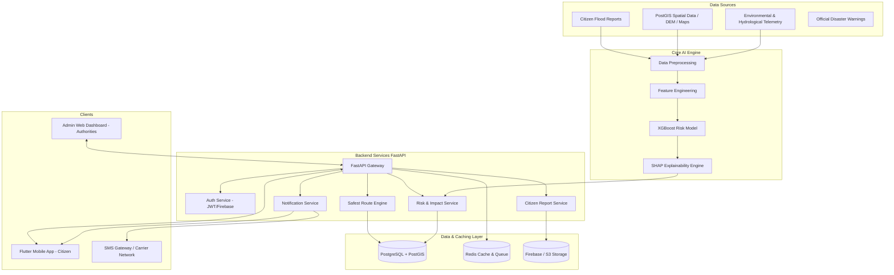

# Technical Architecture — JalRaksha

## 1. System Overview

**JalRaksha** is designed as a high-availability, modular disaster safety system. It bridges the gap between raw hydrological/environmental data and citizen safety by translating complex risk data into hyper-local impact assessments, transparent explanations, safe zone navigation, risk-weighted safest routes, and low-latency emergency communications.

The application follows a **Modular Monorepo Architecture** comprising:
1. **Mobile Client (Flutter)**: Cross-platform iOS/Android app with offline-first caching and native location/SMS integration.
2. **Backend API (FastAPI)**: Asynchronous REST API providing high-throughput endpoints for risk queries, routing requests, citizen reports, and emergency actions.
3. **Spatial Database (PostgreSQL + PostGIS)**: Geospatial database managing spatial geometries, elevation models, road networks with dynamic weight costs, and village infrastructure.
4. **AI/ML Engine (Python / XGBoost / SHAP)**: Machine learning pipeline predicting Flood Risk Scores (0-100%), confidence intervals, and SHAP-based feature attributions for explainability.
5. **Maps & Routing Engine**: PostGIS spatial algorithms + OSRM integration calculating the **Safest Available Route based on currently available data**.
6. **Notification System (FCM + SMS Gateway)**: Multi-channel alert dispatcher supporting FCM push notifications, direct user SMS, and automated Emergency Contact SMS.
7. **Caching & Queue (Redis)**: Session store, active navigation tracking, and risk penalty cache.
8. **Admin / Disaster Management Dashboard**: Web console for real-time regional monitoring, citizen report triage, and emergency dispatch.

---

## 2. System Architecture Diagram



---

## 3. Core MVP Flow

The system enforces a strict end-to-end user safety flow:

```
User 
  ↓ 
Authentication 
  ↓ 
Location (GPS / Geofence) 
  ↓ 
Flood Risk Score (0-100%) 
  ↓ 
"Why am I getting this warning?" (SHAP Factors) 
  ↓ 
Alert Generation (Low 🟢 / Watch 🟡 / Prepare 🟠 / Critical 🔴) 
  ↓ 
Safe Zone Detection (Nearest verified shelter) 
  ↓ 
Safest Available Route Calculation (Risk-weighted routing) 
  ↓ 
Emergency Circle Verification 
  ↓ 
"I'm Safe" / "Need Help" Quick Actions 
  ↓ 
Citizen Flood Report Submission (Ground truth feedback)
```

---

## 4. Safety / Data Distinction Protocol

To prevent public panic and comply with legal disaster management mandates, JalRaksha strictly tags all data objects and UI components with explicit **Data Sources**:

| Data Source Tag | Description | UI Display Requirement |
| :--- | :--- | :--- |
| `OFFICIAL_DATA` | Verified warnings issued by NDMA, SDMA, or CWC | Displayed with official shield badge: **"OFFICIAL GOVT WARNING"** |
| `AI_PREDICTION` | Risk scores & impact predictions generated by JalRaksha ML | Displayed with AI badge: **"AI ESTIMATE (NOT OFFICIAL WARN)"** |
| `CITIZEN_REPORT` | Geotagged ground reports from citizens | Displayed with community badge: **"CITIZEN REPORT (UNVERIFIED)"** |
| `SIMULATED_DEMO_DATA` | Synthetic data generated for testing or demo mode | Displayed with watermarked banner: **"DEMO / SIMULATED DATA"** |

### Strict Operational Rule
> **AI-generated risk predictions must NEVER be presented as official government disaster warnings.** All AI alerts must include explicit confidence scores, data freshness timestamps, and a disclaimer stating: *"JalRaksha AI prediction is designed to supplement personal safety awareness and does not replace official government evacuation orders."*

---

## 5. Routing Safety Disclaimer Protocol

The navigation system calculates routes by penalizing high-risk areas, flooded roads, submerged bridges, and citizen hazard reports.

### Mandatory Routing Disclaimer Rule
> **JalRaksha will NEVER claim a route is "100% safe" or "Guaranteed Safe."** All route recommendations must be explicitly labeled:
> **"Safest Available Route based on currently available data."**

---

## 6. Monorepo Component Architecture

```
JalRaksha/
├── mobile/            # Flutter Cross-Platform App (Android / iOS)
├── backend/           # FastAPI Asynchronous Service
├── ml/                # Python XGBoost & SHAP Risk Pipelines
├── admin-dashboard/   # HTML5/JS Administrative Web Console
├── database/          # PostgreSQL + PostGIS DDLs, Migrations, Seed Data
├── docs/              # Comprehensive System Documentation
├── infrastructure/    # Docker Compose, Nginx, Deployment Configurations
└── tests/             # Cross-module Automated Test Suite
```

### Component Decoupling Strategy
- **`mobile/`** communicates with `backend/` strictly via authenticated REST APIs (`/api/v1/*`).
- **`ml/`** runs as an isolated analytical engine or imported module exposing clean Pydantic schema interfaces for risk inference.
- **`admin-dashboard/`** consumes the admin subset of backend APIs (`/api/v1/admin/*`).
- **`database/`** manages PostGIS spatial functions independently via SQL scripts and Alembic migrations.
